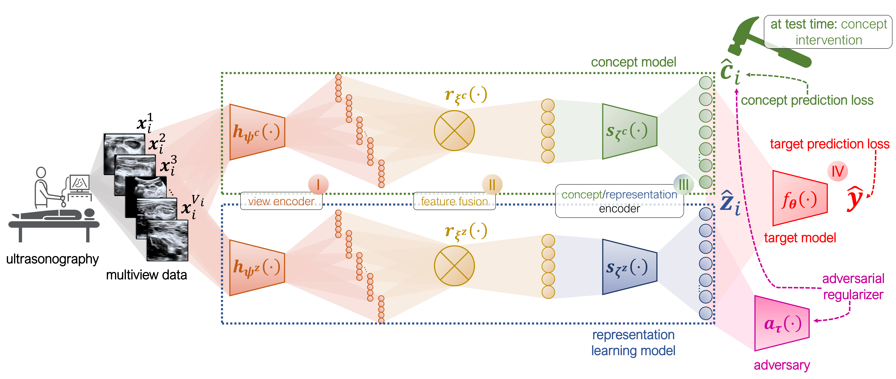

# Semi-supervised Multiview Concept Bottleneck Models Applied to Pediatric Appendicitis

This repository accompanies the paper ["*Interpretable and intervenable ultrasonography-based machine learning models 
for pediatric appendicitis*"](https://arxiv.org/abs/2302.14460). An earlier version of this work was presented as an 
[oral spotlight](https://www.youtube.com/watch?v=QOn102OVaGw) at the 
[2<sup>nd</sup> Workshop on Interpretable Machine Learning in Healthcare (IMLH), ICML 2022](https://mds.inf.ethz.ch/fileadmin/user_upload/multiview_cbm_imlh_2022.pdf). 

<p align="center">
  
</p>
<p align="center">
  <i>Schematic summary of the (semi-supervised) multiview concept bottleneck model.</i>
</p>

### ⏳ Models

**Concept bottleneck models (CBM)** are interpretable predictive models relying on high-level and human-understandable concepts: in practice, 
two models are trained, namely, (*i*) one mapping from the explanatory variables to the given concepts and 
(*ii*) another predicting the target variable based on the previously predicted concept values.

This repository implements extensions of the vanilla CBM to the *multiview classification setting*.
In brief, a **multiview concept bottleneck model (MVCBM)** consists of the following modules: (*i*) per-view feature 
extraction; (*ii*) feature fusion; (*iii*) concept prediction and (*iv*) label prediction. 
To tackle cases when the given set of concepts is incomplete, for instance, due to the lack of domain knowledge or 
the cost of acquiring additional annotation, we also introduce a **semi-supervised MVCBM (SSMVCBM)** that, 
in addition to utilizing the given concepts, learns an independent representation predictive of the label.

<p align="center">
  
</p>
<p align="center">
  <i>Concept-based classification in the multiview setting.</i>
</p>

### ☑️ Requirements

All the libraries required are in the conda environment [`environment.yml`](environment.yml). To install it, follow the 
instructions below:
```
conda env create -f environment.yml   # install dependencies
conda activate multiview-cbm          # activate environment
```

To prepare the pediatric appendicitis data, run [this Jupyter notebook](notebooks/Preprocess_app_data.ipynb) with the preprocessing code.

### 💾 Data

The *Animals with Attributes 2* (AwA) dataset is freely available [here](https://cvml.ista.ac.at/AwA2/). Before running 
the experiments on the multiview AwA, make sure to copy the file [`datasets/all_classes.txt`](datasets/all_classes.txt)
to the dataset directory. The **pediatric appendicitis dataset** can be downloaded 
from [Zenodo](https://zenodo.org/record/7669442#.Y_cv29KZN6w) (doi: [10.5281/zenodo.7669442](https://doi.org/10.5281/zenodo.7669442)).

### ⚙️ Usage

Script [`train.py`](/train.py) can be used to train and validate concept bottleneck models. [`/bin`](/bin) folder 
contains example shell scripts for the different datasets and model designs. For example, to train an MVCBM on the MVAwA 
dataset run:
```
# An example
python train.py --config configs/config_mawa_mvcbm.yaml
```
where [`configs/config_mawa_mvcbm.yaml`](/configs/config_mawa_mvcbm.yaml) is a configuration file specifying experiment, 
dataset and model parameters. See [`/configs/`](/configs/) for concrete configuration examples and explanation of 
the most important parameters. 

#### Repository Structure

The definitions of the models and architectures can be found in the [`/networks.py`](/networks.py) file. The structure of this repository is described in detail below:
```
.
├── bin					# shell scripts
├── configs				# experiment and model configurations
├── datasets				# data preprocessing, loading and handling
│   ├── app_dataset.py			# pediatric appendicitis dataloaders
│   ├── awa_dataset.py			# AwA 2 dataloaders
│   ├── generate_app_data.py		# data dictionaries for the pediatric appendicitis
│   ├── mawa_dataset.py			# MVAwA dataloaders
│   ├── preprocessing.py		# preprocessing utilities for the pediatric appendicitis
│   └── synthetic_dataset.py		# synthetic dataloaders
├── DeepFill				# DeepFill code
├── intervene.py			# utility functions for model interventions
├── loss.py				# loss functions
├── networks.py				# neural network architectures and model definitions
├── notebooks				# Jupyter notebooks 
│   ├── Preprocess_app_data.ipynb	# prepares and preprocesses pediatric appendicitis data
│   ├── Radiomics.ipynb			# radiomics-based features and predictive models
│   └── radiomics_params.yaml		# configuration file for radiomics feature extraction
├── pretrained_models			# directory with pretrained models, s.a. ResNet-18
├── train.py				# model training and validation script
├── utils				# further utility functions
└── validate.py				# model evaluation subroutines
```

### 🔨 Maintainers

This repository is maintained by [Ričards Marcinkevičs](https://rmarcinkevics.github.io/) ([ricards.marcinkevics@inf.ethz.ch](mailto:ricards.marcinkevics@inf.ethz.ch)).

### 🤗 Acknowledgements

- DeepFill code was taken from the original [implementation](https://github.com/JiahuiYu/generative_inpainting) by [Yu *et al.* (2018)](https://arxiv.org/abs/1801.07892)
- Data loaders for the AwA dataset are based on the code from the [repository](https://github.com/dfan/awa2-zero-shot-learning) by David Fan

### 📚 References

To better understand the background behind this work, we recommend reading the following papers:
 - Kumar, N., Berg, A.C., Belhumeur, P.N., Nayar, S.K.: Attribute and
simile classifiers for face verification. In: 2009 IEEE 12th International
Conference on Computer Vision, pp. 365–372. IEEE, Kyoto, Japan (2009).
https://doi.org/10.1109/ICCV.2009.5459250
- Lampert, C.H., Nickisch, H., Harmeling, S.: Learning to detect unseen
object classes by between-class attribute transfer. In: 2009 IEEE Conference on Computer Vision and Pattern Recognition. IEEE, Miami, FL,
USA (2009). https://doi.org/10.1109/CVPR.2009.5206594
- Koh, P.W., Nguyen, T., Tang, Y.S., Mussmann, S., Pierson, E., Kim, B.,
Liang, P.: Concept bottleneck models. In: Daumé III, H., Singh, A. (eds.)
Proceedings of the 37th International Conference on Machine Learning. Proceedings of Machine Learning Research, vol. 119, pp. 5338–5348.
PMLR, Virtual (2020)
- Marcinkevičs, R., Reis Wolfertstetter, P., Wellmann, S., Knorr, C., Vogt,
J.E.: Using machine learning to predict the diagnosis, management and
severity of pediatric appendicitis. Frontiers in Pediatrics 9 (2021). 
https://doi.org/10.3389/fped.2021.662183
- Havasi, M., Parbhoo, S., Doshi-Velez, F.: Addressing leakage in concept bottleneck models. In: Oh, A.H., Agarwal, A., Belgrave, D., Cho,
K. (eds.) Advances in Neural Information Processing Systems (2022).
https://openreview.net/forum?id=tglniD_fn9

### 📖 Citation

If you use the models or the dataset, please cite the papers below:
```
@inproceedings{KlimieneMarcinkevics2022,
  title={Multiview Concept Bottleneck Models Applied to Diagnosing Pediatric Appendicitis},
  author={Klimiene, Ugne and Marcinkevi{\v{c}}s, Ri{\v{c}}ards and Reis Wolfertstetter, Patricia 
            and Ozkan, Ece and Paschke, Alyssia and Niederberger, David 
            and Wellmann, Sven and Knorr, Christian and Vogt, Julia E},
  booktitle={2nd Workshop on Interpretable Machine Learning in Healthcare (IMLH), ICML 2022},
  year={2022}
}

@misc{MarcinkevicsWolfertstetterKlimiene2023,
  title = {Interpretable and Intervenable Ultrasonography-based Machine Learning Models for Pediatric Appendicitis},
  author = {Marcinkevi\v{c}s, Ri\v{c}ards and Reis Wolfertstetter, Patricia and Klimiene, Ugne 
              and Ozkan, Ece and Chin-Cheong, Kieran and Paschke, Alyssia and Zerres, Julia 
              and Denzinger, Markus and Niederberger, David and Wellmann, Sven 
              and Knorr, Christian and Vogt, Julia E.},
  year = {2023},
  note = {arXiv:2302.14460},
}
```

### Copyright
This repository is copyright © 2023 Marcinkevičs, Reis Wolfertstetter, Klimiene, Ozkan, Chin-Cheong, Paschke, Zerres, 
Denzinger, Niederberger, Wellmann, Knorr and Vogt.

This repository is additionally licensed under CC-BY-NC-4.0.
